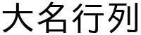
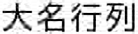
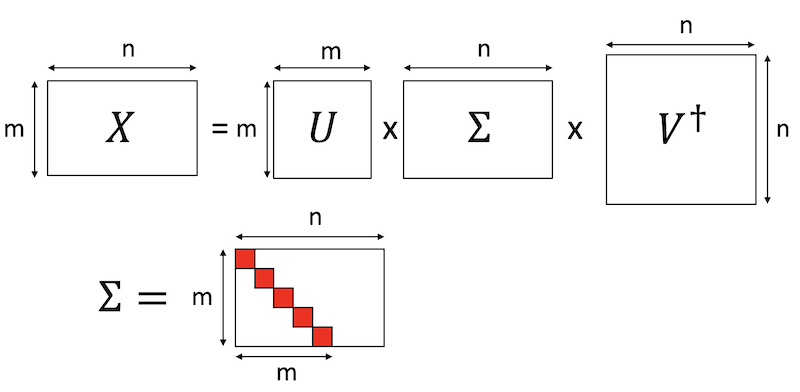

# 大名行列を特異値分解してみる

## はじめに

線形代数には、特異値分解という操作があります。行列を特異値と、それをくくりだす行列に分解する処理です。この分解は可逆処理ですが、特異値の大きいところだけを取り、小さいところを無視することで元の行列を近似することができます。近年、この性質を利用した情報圧縮が様々な場所で積極的に利用されています。筆者の身近なところでは、量子状態をテンソルネットワークで近似する際、特異値分解が中心的な役割を果たします。

本稿では、特異値分解がどういう処理なのか、実際に簡単な行列で試してみて、「なるほど情報圧縮だなぁ」というのを実感することを目的とします。

コードは以下においておきます。

[https://github.com/kaityo256/daimyo_svd](https://github.com/kaityo256/daimyo_svd)

Google ColabでJupyter Notebookを開きたい場合は[こちら](https://colab.research.google.com/github/kaityo256/daimyo_svd/blob/main/daimyo_svd.ipynb)をクリックしてください。

## 特異値分解してみる

まず細かいことはさておき、特異値分解により情報圧縮ができることを確認してみましょう。以下、Google Colabでの実行を想定しています。他の環境で実行する場合は、フォントへのパスの指定の方法など、適宜読み替えてください。

## 対象となる行列の準備

まずは必要なものをimportしましょう。

```py
from PIL import Image, ImageDraw, ImageFont
import numpy as np
from scipy import linalg
```

次に、日本語フォントをインストールします。

```py
!apt-get -y install fonts-ipafont-gothic
```

インストールに成功したら、`ImageFont`のフォントオブジェクトを作っておきましょう。

```py
fpath='/usr/share/fonts/opentype/ipafont-gothic/ipagp.ttf'
fontsize = 50
font = ImageFont.truetype(fpath, fontsize)
```

白地に黒で「大名行列」と書きましょう。

```py
LX = 200
LY = fontsize
img  = Image.new('L', (LX,LY),color=255)
draw = ImageDraw.Draw(img)
draw.text((0,0), "大名行列", fill=0, font=font)
img
```

こんな感じで「大名行列」が表示された成功です。


さて、描画したイメージから、NumPy配列の形で行列を受け取りましょう。単に`np.array`に`img.getdata()`を食わすだけですが、それだと一次元配列になってしまうので、`reshape`で行列にします。

```py
data = np.array(img.getdata()).reshape((LY,LX))
```

この`data`がもとの行列となります。行列要素は、0から255までの値を持ち、ピクセルの輝度を表現します。

逆に、行列をイメージとして表示してみましょう。

```py
Image.fromarray(np.uint8(data))
```

以下のような表示がされたら成功です。



ここで、この行列のランクも確認しておきましょう。`np.linalg.matrix_rank`で確認できます。

```py
np.linalg.matrix_rank(data) # => 47
```

行列のランクは、最大でmin(行, 列)となります。`data`は50行200列の行列なので、ランクは最大で50ですが、「大名行列」の上下に余白があるために少しランクが落ちて、47になっています。これを、より低ランクな行列で近似しましょう、というのが特異値分解による圧縮です。

## 特異値分解と圧縮

では、行列`data`を特異値分解しましょう。`scipy.linalg.svd`で一発です。

```py
u, s, v = linalg.svd(data)
```

それぞれの形状も確認しておきましょう。

```py
print(f"u: {u.shape}")
print(f"s: {s.shape}")
print(f"v: {v.shape}")
```

結果はこんな感じです。

```txt
u: (50, 50)
s: (50,)
v: (200, 200)
```

`u`は50x50、`v`は200x200の正方行列です。`s`は数学的には50行200列の対角行列ですが、どうせ対角成分しかないので`scipy.linalg.svd`は一次元配列を返すことに注意しましょう。この`s`が特異値であり、全て非負の実数で、`scipy.linalg.svd`は降順に並べてくれます。`u`と`v`も特異値に対応した順番に並んでいます。

特異値分解ができたので、もとの行列を低ランク近似しましょう。特異値を大きい方からr個だけ残すことにします。対応して、`u`の左から列ベクトルを`r`個とったものを`ur`、
`v`の上から行ベクトルを`r`個取った行列を`vr`とします。それぞれ50行r列、r行200列の行列になります。特異値については、r行r列の対角行列にしましょう。非負の実数なので、平方根を取ることができます。これを`sr`とし、`ur*sr`を`A`、`sr*vr`を`B`という行列にします。

以上の操作をそのまま実装したのが以下のコードです。ここでは`r=10`としています。

```py
r = 10
ur = u[:, :r]
sr = np.diag(np.sqrt(s[:r]))
vr = v[:r, :]
A = ur @ sr
B = sr @ vr
```

Aは50行r列、Bはr行200列の行列ですから、その積はもとの行列である`data`と同じ、50行200列になります。

```py
print(f"A: {A.shape}")
print(f"B: {B.shape}")
print(f"AB: {(A*B).shape}")
```

実行結果↓

```txt
A: (50, 10)
B: (10, 200)
AB: (50, 200)
```

しかし、`data`のランクが47だったのに対し、`A*B`は特異値を10個しか残していないため、ランクが10の行列になります。

```py
np.linalg.matrix_rank(A @ B) # => 10
```

確かにランクが10になっていますね。これが低ランク近似と呼ばれる所以です。

さて、`data`という行列が、`A`と`B`という二つの行列で近似されました。どれくらいデータが圧縮されたか見てみましょう。行列の要素数は`size`で取れます。

```py
print((A.size + B.size)/data.size) # => 0.25
```

特異値を10個残した場合は、データは25%に圧縮されたことがわかります。

## データの復元

さて、低ランク近似のより、どれくらい情報が失われたか、イメージになおして見てみましょう。`A*B`により近似されたデータを画像に復元してみます。ただし、もともとピクセルデータが0から255までの値だったのが、近似によりはみ出してしまって画像がおかしくなるので`numpy.clip`により0から255までに押し込めています。

```py
b = np.asarray(A @ B)
b = np.clip(b, 0, 255)
Image.fromarray(np.uint8(b))
```

こんな感じに復元されました。



さらに低ランク近似するとどうなるでしょうか。`r=3`にしてやってみましょう。

```py
r = 3
ur = u[:, :r]
sr = np.diag(np.sqrt(s[:r]))
vr = v[:r, :]
A = ur @ sr
B = sr @ vr
b = np.asarray(A @ B)
b = np.clip(b, 0, 255)
Image.fromarray(np.uint8(b))
```

結果はこんな感じになります。


斜めの線が苦手っぽいですね。

## まとめ

特異値分解がどのように情報圧縮に使われるかを確認するため、「大名行列」と書かれた画像を行列だと思って、特異値分解し、低ランク近似した行列を作り、情報圧縮率を確認し、データを復元してみました。このコードを試してみて、「なるほど低ランク近似だなぁ」と思ってもらえれば幸いです。

## 補足資料

上記の操作の数学的な側面について補足しておきます。

## 特異値とは

正方行列$A$について、以下のような分解を考えます。

$$
A = P^{-1} D P
$$

ただし、$P$は正則行列、$D$は対角行列です。このような分解ができる時、$A$は対角化可能といい、$D$は対角要素に$A$の固有値を並べたもの、$P$は$A$の固有ベクトルを列ベクトルとして並べたものになります。

行列の固有値と固有ベクトルは大事だ、というのは[線形代数を学ぶ理由](https://qiita.com/kaityo256/items/872a2b2fdf977c0e3fbb)でも書きました。行列の性質は、固有値と固有ベクトルで決まります。そして固有ベクトルは、固有値の絶対値が大きい順番に元の行列の性質の責任を担います。例えば、絶対値最大の固有値を持つ固有ベクトルは、行列が時間発展演算子の場合には平衡状態に、行列が量子力学の時間非依存ハミルトニアンを表すならば基底状態を表現します。また、行列がマルコフ遷移行列の場合には絶対値最大の固有値絶対値が1となり、二番目に大きい固有値が定常状態への緩和速度を決めます[^markov]。

[^markov]: マルコフ遷移行列と線形代数の関係は、いつか書きたいと思いつつ数年書けてません。「書いて！」という強い要望があれば頑張れるかも。

さて、行列の固有値、固有ベクトルは、正方行列にしか定義できません。しかし、一般の長方形の行列に対して似たようなことがしたい場合があります。そんな時に使うのが特異値分解です。

$m$行$n$列($m<n$) の行列$X$を考えます。特異値分解とは、行列$X$を以下のように分解することです。

$$
X = U \Sigma V^\dagger
$$

ただし、$U$はm行m列の正方行列、$V$はn行n列の正方行列で、どちらもユニタリ行列です。$V^\dagger$は$V$の随伴行列です。$\Sigma$は$m$行$n$列の対角行列で、対角に並んだ要素を$X$の特異値と呼びます。特異値は非負の実数で、要素数は$X$の行と列の少ない方、$m<n$の場合は$m$個となります。便利のために、$\Sigma$は上から特異値の大きい順に並べておきます。

## ランクとは

行列のランク(階数)とは、行列を「行ベクトルが並んだものとみなしたときの線形独立なベクトルの数」もしくは「列ベクトルが並んだものとみなしたときの線形独立なベクトルの数」です。両者の定義は一致します。$m$行$n$列($m<n$)の長方形の行列においては、$m$次元の列ベクトルが$n$個並んでいることになります。$m$個の線形独立なベクトルがあれば$m$次元空間を張れますから、線形独立な列ベクトルは$m$個を超えることができません。$m>n$の場合も同様です。以上から、$m$行$n$列の行列のランクは、最大で$\min(m,n)$となります。直感的に、行列が線形従属なベクトルを多数含めば含むほど、行列が持つ「本質的な情報量」が減るのはわかると思います。

## 低ランク近似

さて、行列積の定義により、$m$行$r$列の行列と、$r$行$n$列の行列をかけると、真ん中の$r$個の足がつぶれて$m$行$n$列の行列になります。ここから$r$を小さくとることで、$m$行$n$列の行列を、$m$行$r$列の行列と$r$行$n$列の行列二つで近似することができます。


行列のランクは、行と列の小さい方で決まります。したがって、$r < m < n$ならば、$m$行$r$列の行列も、$r$行$n$列も、ランクは最大で$r$です。ランク$r$同士の行列をかけてもランクは増えないので、$AB$という$m$行$n$列の行列のランクも$r$となります。

このように、ある行列を別の小さい行列の積で近似する際、もとの行列より低いランクの行列で近似する、低ランク近似になっています。このような小さい行列の作り方にはいろんな方法がありますが、フロベニウスノルムの意味で最良近似になっているのが特異値分解を用いた近似です。

いま、$m$行$n$列の行列$X$の特異値分解

$$
X = U \Sigma V^\dagger
$$

が得られているとしましょう。$U$と$V$はそれぞれ$m$行$m$列、$n$行$n$列の正方行列で、どちらもユニタリ行列です。$V^\dagger$は$V$の随伴行列(転置して複素共役をとったもの)です。$\Sigma$は$m$行$n$列の対角行列で、対角要素に特異値が並んでいます。この際、上から大きい順に並べておきます($U$と$V$も対応するように決めます)。



さて、特異値を$r$個だけ使った低ランク近似をすることにしましょう。これは、$\Sigma$の左上から$r$行$列$の正方行列部分だけ使い、$U$の列ベクトルを左から$r$個、$V^\dagger$の行ベクトルを上から$r$個とってもとの行列を近似する形になります。さて、特異値は非負の実数で、$\Sigma$は対角行列なので、$\Sigma = \sqrt{\Sigma} \sqrt{\Sigma}$と分けることができます。これを$U$由来の行列と$V^\dagger$由来行列とまとめましょう。図解するとこんな感じです。


以上から、

$$
\tilde{X} = A B
$$

を得ます。こうして、$m$行$n$列の行列$X$が、特異値分解を通じて$m$行$r$列の行列$A$と、$r$行$n$列の行列$B$の積として近似できました。もとの行列のランクは最大で$\min(m,n)$ですが、こうして近似された行列のランクは最大で$r$になります。もともと$m*n$個あった行列要素は、$r*(m+n)$になりました。$r$が小さいときには情報が圧縮されたことがわかります。
